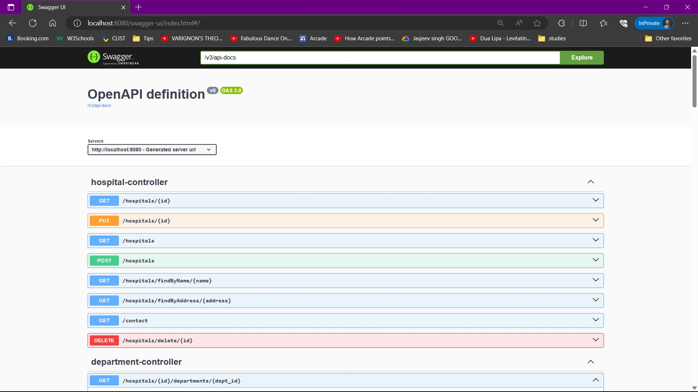
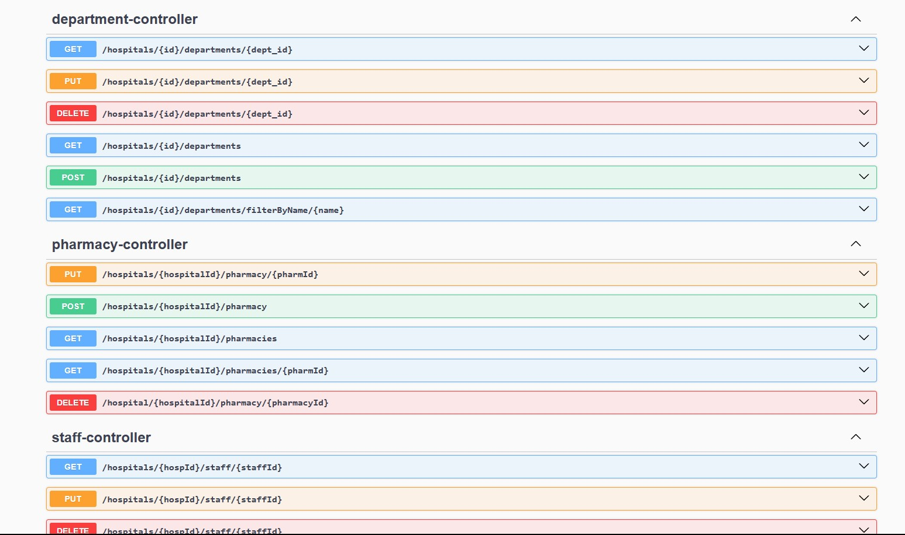
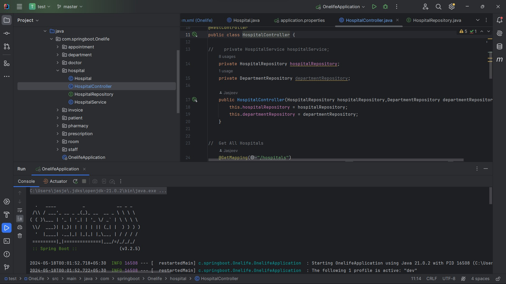
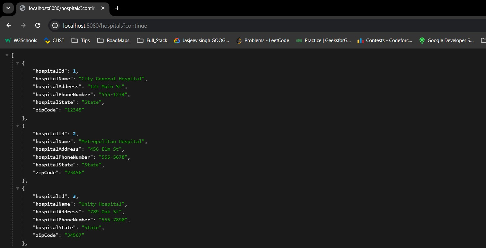
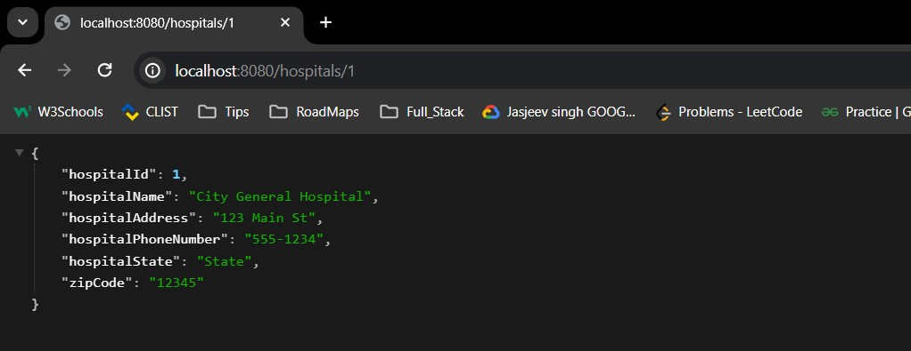
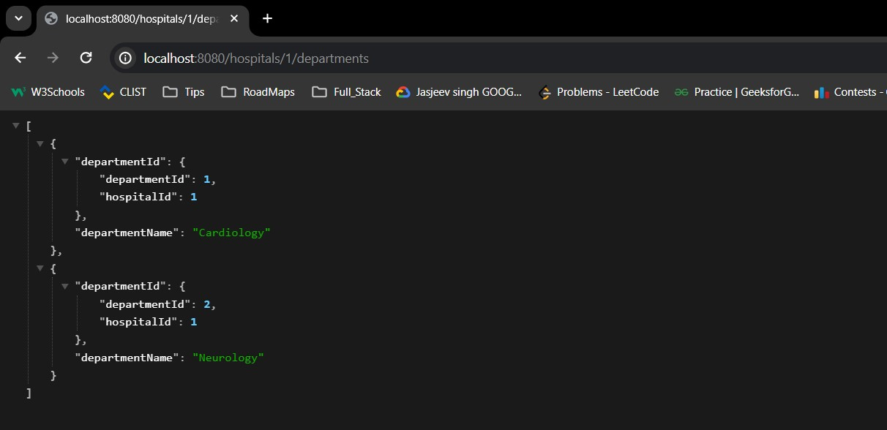

# OneLife: Your HealthCare Management

## Table of Contents

- [Overview](#Overview)
- [Features](#Features)
- [Technical Stack](#Technical-Stack)
- [Setup Instructions](#Setup-Instructions)
- [Screenshots](#Screenshots)
- [Contributing](#contributing)
- [License](#license)
- [Contact](#contact)


## Overview
OneLife is a robust backend REST API built using Spring & SpringBoot, designed to manage hospital data at various levels, from state to country. The API supports CRUD operations with secure authentication and authorization, providing role-based access to different users.

## Features
- **Comprehensive Data Management**: Handles data for hospitals, departments, staff, doctors, patients, pharmacy, invoices, prescriptions, and appointments.
- **Role-Based Access Control**:
    - **Roles**: OWNER, DEVELOPER, ADMIN, MANAGER, RECEPTIONIST
    - **Patient Access**: Patients can check their appointments, invoices, and prescriptions.
- **Authentication & Authorization**: Secure login and registration processes with role-specific data access.
- **CI/CD Pipeline**: Deployed using GitHub and hosted on Railway for continuous integration and delivery.
- **Database**: Online MySQL server for data storage.

## Technical Stack
- **Framework**: Spring & SpringBoot
- **Database**: MySQL
- **Deployment**: Railway
- **Version Control**: GitHub

## Setup Instructions

### Prerequisites
- Java 8 or higher
- Maven
- MySQL

### Installation
1. **Clone the repository**
   ```bash
   git clone https://github.com/yourusername/OneLife.git
   cd OneLife
2. **Configure the database**
    - Create a database named `onelife`.
    - Update the `application.properties` file with your MySQL database credentials.
   ```properties
   spring.datasource.url=jdbc:mysql://localhost:3306/onelife
   spring.datasource.username=yourUsername
   spring.datasource.password=yourPassword
   spring.jpa.hibernate.ddl-auto=update
3. **Build the project**
   ```bash
   mvn clean install
4. **Run the project**
   ```bash
   mvn spring-boot:run

### Running Locally

- Start MySQL Server 
  - Ensure your MySQL server is running.
- Run the Spring Boot Application

    ```bash
    mvn spring-boot:run

- The application will be available at http://localhost:8080.

### Working 

- Authentication & Authorization
  - Secure login and registration.
  - Role-based access control.
  
- Managing Hospitals 
  - CRUD operations for hospital data.
- Patient Access 
  - Patients can view their appointments, invoices, and prescriptions.
- CI/CD Pipeline 
  - Continuous integration and deployment using GitHub and Railway.

## Screenshots
- The All Rest API

- More API's showing using Swagger UI

- Code running locally

- Hospital Owner API Working

- Hospital ADMIN API working

- Departments API working


## Contributing
Feel free to contribute by forking the repository and submitting a pull request. For major changes, please open an issue first to discuss what you would like to change.

## License

This project is licensed under the [MIT License](LICENSE).

## Contact

- Email: jasjeev99@gmail.com
- LinkedIn: [LinkedIn Profile](https://www.linkedin.com/in/jasjeev-singh-k-773238247)
- Portfolio: [My Portfolio](https://www.linktr.ee/jskkk_013)